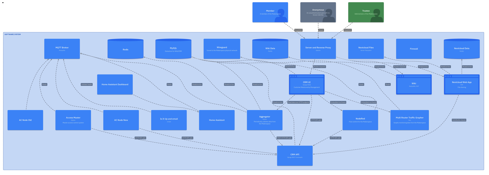
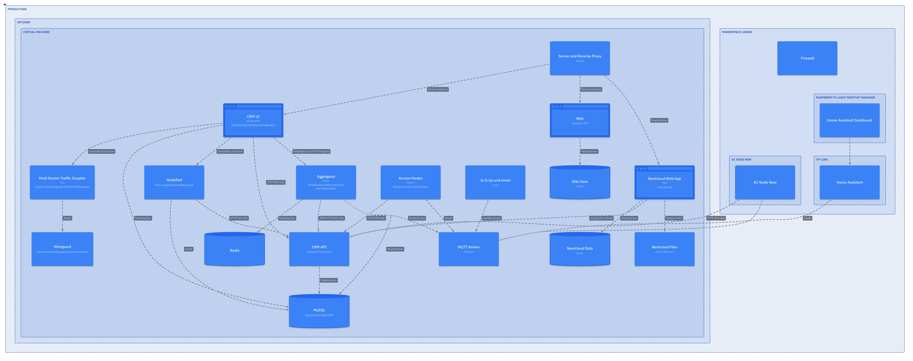

# System Documentation

This repository contains [C4 model files](https://c4model.com/) (.c4) that define software architecture models for the various Makerspace systems. From these models, we can dynamically generate views of the Makerspace software system.

## What is C4 Modeling?

The C4 model was created to help build better mental models of their software architecture and communicate these models effectively to others.

It consists of four levels of abstraction:

* **Context**: The highest level view showing your software system in its environment, including the people who use it and the other systems it interacts with. This answers the "what" and "why" questions and helps establish scope and boundaries.
* **Containers**: Zooms into your software system to show the high-level technical building blocks. A container represents an application or data store that needs to be running for the overall system to work. Examples include web applications, mobile apps, databases, file systems, etc.
* **Components**: The logical components within each container
* **Code**: The implementation details

*Note: For our purposes we will be focusing on the Context and Containers levels.*


## Diagrams

Currently we have the following views available:

1. [System Landscape](./assets/index.png)
2. [System Containers](./assets/member.png)
3. [Deployment](./assets/production.png)

### System Landscape




#### Deployment

The deployment view is a mapping of the software containers onto physical hardware.




## Generating Output Diagrams

To generate diagrams from the C4 model, you can use the [likec4](https://github.com/LikeC4/likec4) tool. This offers a DSL and command-line tool that can be used to generate diagrams from C4 model files.

### Generate static diagrams

To generate static diagrams in an `./assets` directory, you can use the following command:

```
npx likec4 export png -o ./assets
```

### Generating Interactive Diagrams

```
npx likec4 build -o ./dist
```


## Acknowledgments

* [Simon Brown](https://simonbrown.je/) for creating the [C4 model methodology](https://c4model.com/)
